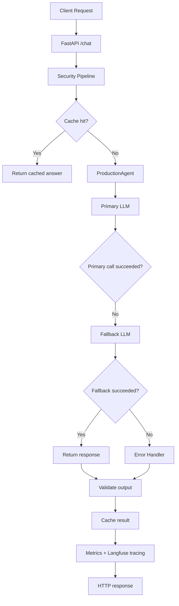
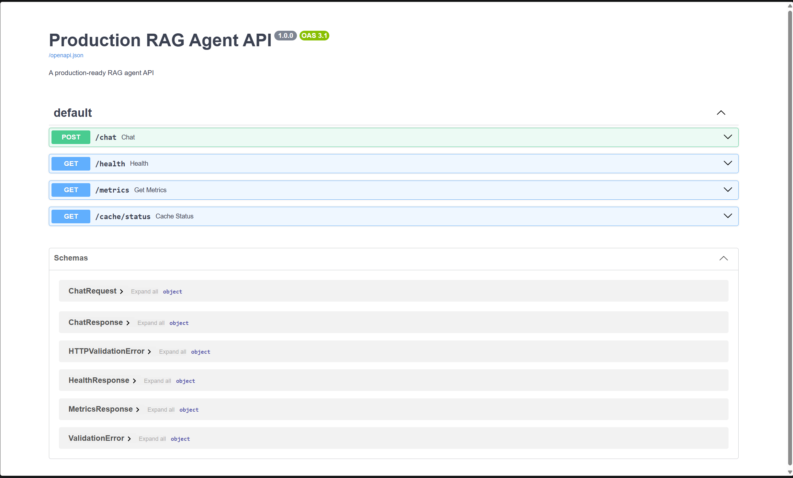
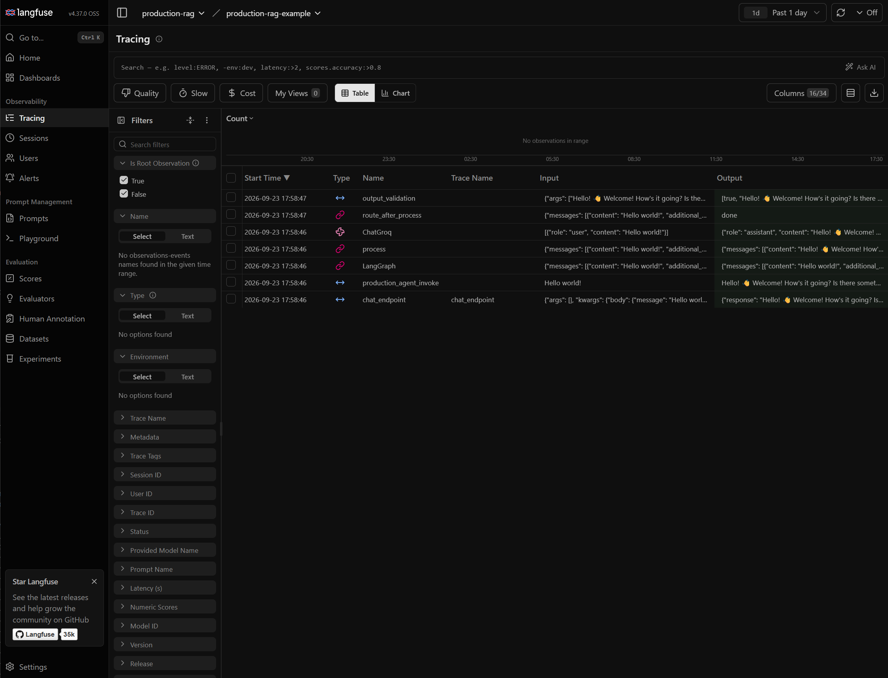
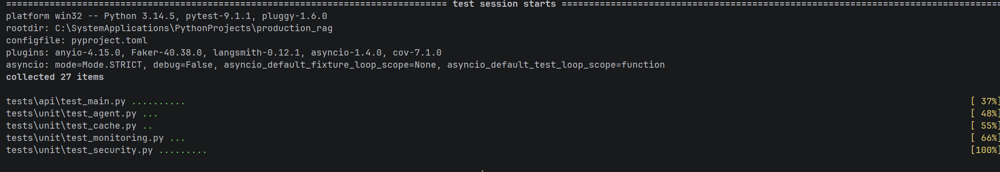

<p align="center">
	
</p>

<div align="center">

# Production RAG

[](https://www.python.org/)
[](https://fastapi.tiangolo.com/)
[](https://langchain-ai.github.io/langgraph/)
[](LICENSE)
</div>

A production-oriented FastAPI application for a LangGraph-powered RAG assistant. It combines retrieval, orchestration,
security checks, tracing, and operational metrics in a structure suitable for local development and deployment.

## Overview

This repository is intended as a practical starting point for building a production-ready retrieval-augmented generation
system with the following capabilities:

- FastAPI HTTP API
- LangGraph orchestration
- LangChain model integration
- caching and request metrics
- input and output validation
- Langfuse observability
- Test automation and coverage checks

## Why this project exists

The goal is to build a secure and observable RAG service that is useful in real deployment scenarios, not just a
notebook prototype. In production, RAG systems often fail due to weak chunking, embedding mismatches, noisy retrieval,
context overflow, and model instability. This repo includes patterns and guardrails to tackle those issues early.

## Features

- `/chat` endpoint with security validation and cache checks
- `/health` readiness endpoint
- `/metrics` summary endpoint
- `/cache/status` cache diagnostics
- prompt injection guardrails
- PII detection and masking for input and output
- structured JSON logging
- request timing and performance metrics
- FastAPI validation with Pydantic models
- pytest-based testing with coverage support

## Architecture overview



This flow reflects the actual application structure
in [app/agent.py](app/agent.py), [app/main.py](app/main.py), [app/security.py](app/security.py),
and [app/cache.py](app/cache.py).

## Project structure

```text
.
├── app/
│   ├── agent.py
│   ├── cache.py
│   ├── config.py
│   ├── main.py
│   ├── models.py
│   ├── monitoring.py
│   └── security.py
├── tests/
│   ├── api/
│   ├── unit/
│   └── conftest.py
├── images/
│   └── .gitkeep
├── .env.example
├── .github/workflows/ci.yml
├── Dockerfile
├── docker-compose.yml
├── CONTRIBUTING.md
├── LICENSE
├── pyproject.toml
├── README.md
├── uv.lock
└── study/
```

## Requirements

To run this project locally, you need:

- a valid LLM API key from Groq or another provider
- or a local Ollama instance
- a Langfuse instance or local Langfuse service
- PostgreSQL with pgvector extension, or the provided Docker-based setup
- Python 3.14 (as declared in the project configuration)

## Quick start

### 1. Install dependencies

```bash
uv sync --group dev
```

### 2. Configure environment

Copy the environment template:

```bash
cp .env.example .env
```

Then update the values in `.env` with your own secrets and endpoints, for example:

```env
APP_ENV=dev
LOG_LEVEL=INFO
RATE_LIMIT=20/minute
CACHE_TTL_SECONDS=300
MAX_RETRIES=3
GROQ_API_KEY=your_key_here
LANGFUSE_SECRET_KEY=your_secret
LANGFUSE_PUBLIC_KEY=your_public_key
LANGFUSE_BASE_URL=http://localhost:3000
```

### 3. Start local dependencies

Use Docker Compose to bring up the supporting services:

```bash
docker compose up -d
```

This starts:

- Langfuse on `http://localhost:3000`
- Ollama on `http://localhost:11434`
- PostgreSQL on `localhost:5432`

### 4. Run the application

```bash
uv run python -m uvicorn app.main:app --reload
```

The API will be available at:

- `http://localhost:8000/docs`
- `http://localhost:8000/health`
- `http://localhost:8000/chat`

## API endpoints

### `POST /chat`

Submit a message to the assistant.

Example request:

```json
{
	"message": "Summarize the project status",
	"thread_id": "thread-123"
}
```

### `GET /health`

Returns service readiness and dependency state.

### `GET /metrics`

Returns runtime metric summaries for latency, token usage, and error rate.

### `GET /cache/status`

Returns response cache hit/miss statistics and current cache size.

## RAG best practices and implementation notes

### Embedding model consistency

In a RAG pipeline, it is important to ensure the chunker, tokenizer, and embedding model are consistent across indexing
and querying.

Key principles:

- Use the same embedding model for indexing and querying.
- Use the same tokenizer for indexing and querying.
- Embedding quality matters more than dataset size.
- Test retrieval separately from generation.

For most production use cases, embedding dimensions typically range from 768 to 1536.

### Chunking strategy

The project notes that chunking quality is a major source of retrieval issues.

1. Fixed chunking is often too rigid and can create incomplete context windows.
2. Recursive chunking is more effective because it respects natural paragraph and sentence boundaries.
3. Semantic chunking can improve retrieval quality by splitting based on meaning and similarity.
4. Late chunking embeds the full document first, then chunks around that context for better contextual awareness.

### Why RAG fails in production

Common reasons include:

1. Bad chunking
2. Embedding mismatch
3. Retrieval noise
4. Context overflow beyond the model context window
5. Hallucination caused by weak retrieval and weak validation

### LLM debugging challenges

Large language models are difficult to debug because:

- outputs are non-deterministic
- failures can cascade through retrieval and generation
- silent failure can present confident but wrong output
- costs can rise unexpectedly from repeated loops or poor retrieval

## Observability and operational guidance

### Traces

Capture:

- agent flow
- inputs and outputs
- tool calls
- decision paths

### Metrics

Track:

- token count
- latency per step
- cost per run
- error rates

### Evaluation

Measure:

- correctness
- relevance
- human feedback
- regression detection

### Vector index tuning

Two common index types are HNSW and IVF.

#### HNSW

HNSW creates a multilayer graph and generally provides a better speed-to-recall tradeoff than flat scans, though it can
be more memory intensive.

Typical HNSW parameters:

- `m`: maximum number of connections per layer
- `ef_construction`: candidate list size used when building the graph

#### IVF

IVF partitions vectors into lists and searches only the most relevant subsets. It can be more efficient for large
datasets but may trade off recall.

Important tuning points:

- create the index after enough data exists
- set a reasonable number of lists
- tune the number of probes at query time for recall vs speed

## Cost optimization notes

### Reduce dimensions

If a model can work with a smaller embedding size, reducing vector dimensions can lower cost significantly.

### Quantization

Converting float32 vectors to lower-precision representations can reduce memory and storage cost.

### Batch queries

Batching requests reduces round-trips and is generally more efficient than making thousands of individual calls.

### Caching

Frequent repeated queries can be cached after embedding or retrieval to reduce repeated inference and retrieval cost.

### Right-size the system

Always start small, observe demand, and scale based on real measurements instead of overprovisioning unnecessarily.

## Security checklist

This project includes several security controls, but they should be treated as baseline protections and not a full
replacement for production security review.

1. Input sanitization blocks prompt injection attempts.
2. PII detection masks sensitive values in both input and output.
3. Rate limiting reduces abuse and resource exhaustion.
4. Pydantic validation validates request and response payloads.
5. Docker should avoid running as root in production.
6. Secrets must be managed securely through environment variables or secret managers.

## Reliability checklist

1. Regular backups and disaster recovery procedures
2. Monitoring and alerting for system health
3. Load testing and performance validation
4. Model fallback support
5. Retry logic with controlled backoff
6. Graceful error handling and safe defaults

## Observability checklist

1. Langfuse tracing
2. structured JSON logging
3. metrics collection for latency, tokens, and errors
4. metrics endpoint exposure

## Performance checklist

1. response caching with TTL
2. cache statistics endpoint
3. token budget awareness
4. retrieval and generation optimization

## Deployment checklist

1. Docker container with health checks
2. docker-compose setup for local development
3. `.env.example` template for required environment variables
4. automated test coverage and CI pipeline

## Testing and CI

Run the test suite locally:

```bash
uv run pytest tests -q
```

Run the suite with coverage:

```bash
uv run pytest --cov=app --cov-report=term-missing --cov-fail-under=90 tests -q
```

This project is set up for automated validation in CI to ensure that test coverage and core behavior remain healthy
across commits.

## Commit conventions

This project follows Conventional Commits.

### Common commit types

| Type       | Purpose                               | Example                                                          |
|------------|---------------------------------------|------------------------------------------------------------------|
| `feat`     | add new functionality                 | `feat(api): add cache status endpoint`                           |
| `fix`      | fix a bug                             | `fix(validation): prevent null pointer in email validation`      |
| `docs`     | update documentation                  | `docs: add authentication section to API guide`                  |
| `style`    | formatting-only update                | `style: remove trailing whitespace and fix indentation`          |
| `refactor` | restructure without changing behavior | `refactor(parser): split monolithic parser into smaller modules` |
| `perf`     | optimize performance                  | `perf(cache): memoize expensive calculations`                    |
| `test`     | add or update tests                   | `test(checkout): add edge case tests for discount calculations`  |
| `chore`    | maintenance tasks                     | `chore(deps): upgrade jest from v27 to v28`                      |
| `ci`       | CI/CD changes                         | `ci: add automated smoke tests to deployment pipeline`           |
| `revert`   | revert a previous change              | `revert: remove debug logging that broke production`             |

### Best practices

- Include a scope when useful: `feat(api): ...`.
- Write the subject in imperative mood: `add`, `fix`, `update`.
- Keep the subject under 50 characters when possible.
- Add a body for non-trivial changes to explain the reasoning.
- Reference issue numbers when applicable.

Example:

```bash
git commit -m "fix(cache): clear stale entries on startup"
```

Example with a body:

```bash
git commit -m "fix(payment): correct rounding error in tax calculation" \
  -m "The tax calculation was using floor() instead of rounding correctly, which caused discrepancies of up to $0.01 per transaction. Updated to use Decimal with ROUND_HALF_UP for accuracy."
```

## Docker and local services

The project includes Docker support for local development and environment setup.

### Docker Compose services

- Langfuse
- PostgreSQL
- Ollama

### Useful commands

Stop a container:

```bash
docker stop pgvector-container
```

Start a stopped container:

```bash
docker start pgvector-container
```

Reset a container and recreate it:

```bash
docker stop pgvector-container
docker rm pgvector-container
docker run --name pgvector-container -e POSTGRES_USER=langchain -e POSTGRES_PASSWORD=langchain -e POSTGRES_DB=langchain -p 6024:5432 -d pgvector/pgvector:pg16
```

## Screenshots and project views

The project is organized to support screenshots of the most important operational views. Add images under the `images/`
directory and reference them here when available.

### API documentation



### Langfuse dashboard



### Test results



## Contribution

Please see [CONTRIBUTING.md](CONTRIBUTING.md) for local setup, commit conventions, and pull request guidance.

## License

This project is released under the [MIT License](LICENSE).

## Support

For questions, bug reports, or feature requests, open a GitHub issue with reproduction steps, expected behavior, and
environment details.
